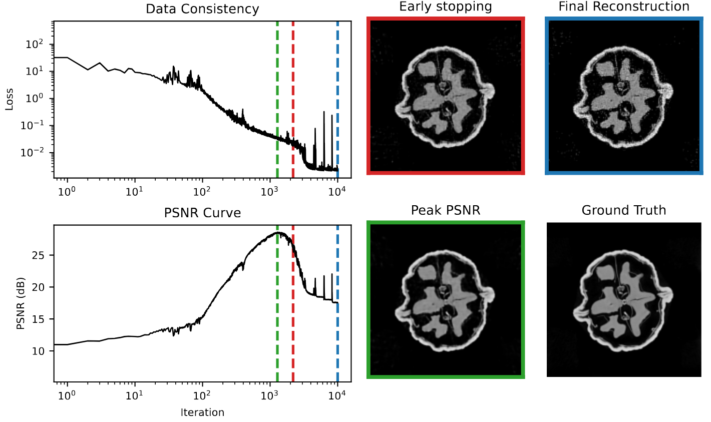

# Deep Image Prior for Computed Tomography

This repository contains the code accompanying the book chapter *"Deep Image Prior for Image Reconstruction"*. We analyze and compare various Deep Image Prior (DIP) methods for computed tomography (CT) image reconstruction, with a focus on μ-CT measurements of a walnut.

<p align="center">
  
  
</p>

## Overview

The [Deep Image Prior](https://dmitryulyanov.github.io/deep_image_prior) leverages the structure of convolutional neural networks as an implicit prior for image reconstruction. Instead of learning from paired datasets, DIP uses a randomly initialised neural network to parameterise the reconstructed image, exploiting the network's inherent bias.

This repository provides implementations of several DIP variants:

| Method | Description | Reference |
|--------|-------------|-----------|
| **Vanilla DIP** | Standard DIP without extensions | [Ulyanov et al. (2018)](https://arxiv.org/abs/1711.10925) |
| **DIP+TV** | DIP with total variation regularisation via autodiff | [Baguer et al. (2020)](https://arxiv.org/abs/2003.04989) |
| **DIP+TV HQS** | DIP+TV using Half-Quadratic Splitting | - |
| **Self-Guidance DIP** | Self-guided regularisation for improved stability | [Liang et al. (2024)](https://arxiv.org/abs/2402.04097) |
| **aSeqDIP** | Auto-encoding Sequential DIP | [Alkhouri et al. (2024)](https://openreview.net/forum?id=K1EG2ABzNE&noteId=KLbtyQ08BC) |
| **EDIP** |  warm-started DIP (pretrained on ellipses dataset) | [Barbano et al. (2022)](https://arxiv.org/abs/2111.11926) | 
## Installation


### Setup Environment

To get started, clone the repository and install

```bash
pip install -e .
```

This will install all the necessary packages in your current enviroment.

## Data

### Walnut CT Dataset

First, the [Walnut dataset](https://zenodo.org/records/2686726) has to be downloaded from zenodo. It is sufficient to only download [Walnut1.zip](https://zenodo.org/records/2686726/files/Walnut1.zip?download=1) and place it in the `data/` directory.

The forward operator (ray transform matrix) can be constructed by running:

```bash
python create_walnut_ray_trafo_matrix.py
```

> **Note:** This construction can take up to 45 minutes.

Alternatively, download the pre-computed matrix directly from [Zenodo](https://zenodo.org/record/7282279/files/single_slice_ray_trafo_matrix_walnut1_orbit2_ass20_css6.mat?download=1) and place it in the `data/` directory.

## Usage

### Quick Start

Run DIP reconstruction with default settings:

```bash
python run_dip.py --method vanilla --model_inp random
```

### Available Methods

```bash
# Vanilla DIP (with random input)
python run_dip.py --method vanilla --model_inp random

# Vanilla DIP (with FBP input)
python run_dip.py --method vanilla --model_inp fbp

# DIP with Total Variation (autodiff)
python run_dip.py --method tv --model_inp random

# DIP with TV using Half-Quadratic Splitting
python run_dip.py --method tv_hqs --model_inp random

# Self-Guidance DIP
python 

# Auto-encoding Sequential DIP
python 
```

## Citation

If you use this code in your research, please cite:

```bibtex
@misc{arridge2026deepimagepriorcomputed,
      title={Deep Image Prior for Computed Tomography Reconstruction}, 
      author={Simon Arridge and Riccardo Barbano and Alexander Denker and Zeljko Kereta},
      year={2026},
      eprint={2602.14709},
      archivePrefix={arXiv},
      url={https://arxiv.org/abs/2602.14709}, 
}
```


## References

- Ulyanov, D., Vedaldi, A., & Lempitsky, V. (2018). Deep image prior. *CVPR*.
- Baguer, D. O., Leuschner, J., & Schmidt, M. (2020). Computed tomography reconstruction using deep image prior and learned reconstruction methods. *Inverse Problems*.
- Liang, S., Bell, E., Qu, Q., Wang, R., & Ravishankar, S. (2025). Analysis of Deep Image Prior and Exploiting Self-Guidance for Image Reconstruction. *IEEE TCI*.
- Alkhouri, I., Liang, S., Bell, E., Qu, Q., Wang, R., Ravishankar, S. (2024). Image Reconstruction Via Autoencoding Sequential Deep Image Prior. *NeurIPS*
- Barbano, R., Leuschner, J., Schmidt, M., Denker, A., Hauptmann, A., Maass, P., Jin, B. (2023). An Educated Warm Start For Deep Image Prior-Based Micro CT Reconstruction. *IEEE TCI*.

